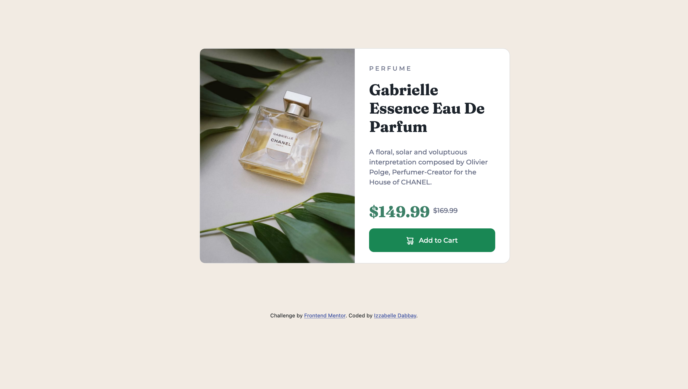

# Frontend Mentor - Product preview card component solution

This is a solution to the [Product preview card component challenge on Frontend Mentor](https://www.frontendmentor.io/challenges/product-preview-card-component-GO7UmttRfa). Frontend Mentor challenges help you improve your coding skills by building realistic projects.

## Table of contents

- [Overview](#overview)
  - [The challenge](#the-challenge)
  - [Screenshot](#screenshot)
  - [Links](#links)
- [My process](#my-process)
  - [Built with](#built-with)
  - [What I learned](#what-i-learned)
  - [Continued development](#continued-development)
  - [Useful resources](#useful-resources)
- [Author](#author)


## Overview

### The challenge

Users should be able to:

- View the optimal layout depending on their device's screen size
- See hover and focus states for interactive elements

### Screenshot

Desktop:


Mobile:


### Links

- Solution URL: https://github.com/izzabelledabbay/Product-Preview-Card-Component
- Live Site URL: https://izzabelledabbay.github.io/frontendchallenge-1/

## My process

### Built with

- Semantic HTML5 markup
- CSS custom properties
- Bootstrap 5

### What I learned

I learned how to create a mobile-responsive product preview component using Bootstrap5 and Media Queries.

```css
@media (max-width: 375px) {
  .container-fluid {
    padding: 5% 4%;
  }

  .card {
    margin-left: 0;
  }

  .card-body {
    padding-left: 25px;
    padding-right: 25px;
  }

  h2.product-name {
    width: 80%;
  }

  .image-product1 {
    display: none;
  }

  .image-product2 {
    border-radius: 10px 10px 0 0;
    display: block;
  }

  .price-1 {
    width: 40%;
  }

  .price-2 {
    width: 40%;
  }
}
```

### Continued development

I struggled the most with keeping the bootstrap columns containing the prices side by side when switching to the mobile view. I had to override the bootstrap columns with media query to achieve the final design. I hope to practice more on creating mobile-responsive layouts.

### Useful resources

- [The Complete 2022 Web Development Bootcamp](https://www.udemy.com/course/the-complete-web-development-bootcamp/?src=sac&kw=the+complete+web+development+bootcamp) - I'm currently taking this Web Development course on Udemy. So far I've learned about HTML5, CSS, and Bootstrap which I applied to this challenge
- [Bootstrap Docs](https://getbootstrap.com/docs/5.0/getting-started/introduction/)


## Author

- Frontend Mentor - [@izzabelledabbay](https://www.frontendmentor.io/profile/izzabelledabbay)
